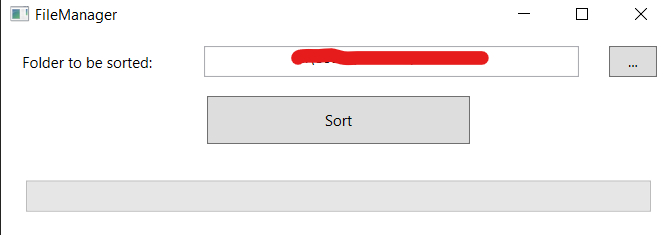

# FileManagement-CS

---
## Description

To many times I've found my "Download" folder unorganized. So, to get a clear view on what's happening in there, I decided to create a little utility to sort all of my files automatically.

---
## How to use 

### JSON file

You can find `types.json` in the FileManagement Folder. 
The content of this file defines the overall structure the files will be sorted in. 

Each key is the name of a folder and the array represents the file extensions that will go in there.

For example : 

```json
{
    "image" : ["png"]
}
```

This will put all the images with the extention png in the folder "image".

### GUI

Here is the GUI of the tool : 



It is pretty straight forward : 
you select a folder you want to sort and click "Sort". 